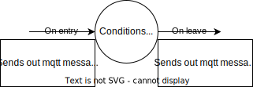

# VAC project
## Table of contents

## About
This project was **started** on **July 4th, 2022** during **Open Summer of Code 2022**.  

*VAC - Voice Assistant Confidentiality* project aims to explore a new way to use voice assistants to help people, while taking their privacy into account.  
To do that, we lean on an existing open-source voice assistant called Rhasspy, and use it offline.
The bot, VAC, is currently able to follow a simple conversation and relevant pre-determined information can be shown on a screen.  
Our current use-case and conversation was created to educate people on sexual harassment and how to seek for help.

Check out our [project page](https://osoc22.github.io/project-hey-bosa/) to know more!

**Last tested on**: July 28th, 2022.  
**OS and versions:**
* **Raspberry Pi**: Raspberry Pi OS with desktop (release date April 4th 2022)
    * System: 64-bit
    * Kernel version: 5.15
    * Debian version: 11 (bullseye)
* **Server for the NLU / Intent handling / UI**: laptop running on Windows 10.


### The team
* Ana Gagua - *User Experience Researcher*
* Aurore Van Hoorebeke - *Full Stack developer*
* Frederik Stroobandt - *IOT specialist*
* Erinn Van Der Sande - *NLU expert*
### Coaches
* Bavo Lodewyckx
* Inti Valderas Caro
* Miel Van Opstal

### Made possible by
* [BOSA Digital Transformation Office](https://bosa.belgium.be/)
* [IO](https://www.iodigital.com/)
* [Dalberg Data Insights](https://dalberg.com/what-we-do/dalberg-data-insights/)
## Setup
### Hardware
* Raspberry PI
* USB headset
* Button to activate the bot
### Software
* **Raspberry**:  
    * Run this commmand in your terminal 
    ```sh
    docker run -it     -p 12101:12101     -v "$HOME/.config/rhasspy/profiles:/profiles"     --device /dev/snd     rhasspy/rhasspy     --profile en     --user-profiles /profiles^
    ```
* **Server-side**:
    * Install [Docker](https://www.docker.com/get-started/)
    * In the project folder, run `docker compose up`
    * You can find the different web interfaces to these adresses:
        * `http://localhost:5000/` (UI reacting to MQTT messages)
        * `http://localhost:12101/` (Rhasspy web interface)

## Current implementation
### Architecture overview

* There are three hardware components which contain different parts of software.
    * **Raspberry Pi** The Raspberry Pi handles the **audio** (input and output) and wakeword of Rhasspy communicating everything to an **external** MQTT broker (the current one is running on the server)
    * **Server** The server does all the hard work. It takes the audio from the Raspberry Pi and creates the **text** using **kaldi** (through Rhasspy). It gives the text to **Rasa** to get the **intent** (Through Rhasspy). The **handler** will take this and guide the **conversation** (over MQTT).
    * **Arduino** The arduino acts as a medium to pass on the **button** signal. It sends the MQTT broker that the button has been pressed down.
### Rhasspy (Voice assistant)
#### Configuration
In the repository you can find 3 files in the 
`config/rhasspy/profiles/en/` folder.

### Speech To Text
The speech to text system we use is called Kaldi.
It trains a model using the `sentences.ini` file.
This follows the syntax from the [rhasspy documentation](https://rhasspy.readthedocs.io/en/latest/training/).

### NLU (Rasa)
The Rasa model will train using the `sentences.ini` file. 
This follows the syntax from the [rhasspy documentation](https://rhasspy.readthedocs.io/en/latest/training/).

### TTS
For text to speech we use NanoTTS which is the recommended system of Rhasspy.

### Intent handling

The intent handler is a python script which is subscribed to some MQTT topics.
The intent handler uses a conversation data structure to guide the conversation.
The structure allows or different components to be added.
Rhasspy can add text, send a message over MQTT or give the user a choice.
This is extendible using the `ConversationComponent` class.



It has a `on_entry`, `to_leave`, `leave_path`, `not_leave` and `on_leave`.
The `on_entry` will send out an MQTT messages when the node is entered.
The `to_leave`, `leave_path` and `not_leave` contain topics that will decide down which path the conversation will go.
The `on_leave` shows which MQTT messages to send when a node is left.
### UI
The UI was made using a mix of [Flask]("https://flask.palletsprojects.com/") (Python web framework) and JQuery.  

The Python code in `ui/src/app.py` is subscribing to MQTT topics, `hermes/handler/#` and `hermes/button/#`, to be able to show the correct content on the screen.
The last messages recieved can be found on `http://localhost:5000/ping/`.  
This page exists to allow the main page on `http://localhost:5000` to fetch the latest messages recieved over MQTT every second, using AJAX.  

The folder structure follows Flask's requirements. For that reason, you will find all images and js scripts in the `static` folder. The CSS would be placed there as well.  
`templates` Folder contains the HTML files used for the web interface (just `index.html` in our case). 
## Known Issues
* **Security**: while this assistant is meant to be working offline/using a local network, there might be some security concerns. While the hackathon, we assumed the local network the project is running on is correctly protected.
* The code on the UI part could use some refactoring! 

## Future work
Making an amazing product takes time, more time than a hackathon allows.  
You'll find here the ideas we had for the future of the product.

### Hardware
* The project is currently running with a headset for voice input and output. However, this could be changed using a *ReSpeaker* on a *Raspberry PI 3* for the microphone and a simple speaker to hear the bot's answer.
### Rhasspy (Voice assistant)
#### Configuration
Other NLUs and settings could be tested to look at performance
### NLU (Rasa)
* Integrate the newer versions of rasa with Rhasspy
### TTS / STT
* Might be interesting to look at other TTS and STT systems since not all of them have been tested.
### Intent handling
* Currently, we use a button to trigger the conversation with the user. It can easily be replaced with a wake word. For coherence, the MQTT topic `hermes/button/start` and `hermes/button/stop` could be renamed.
* There could be more components added to the conversation handler.
* The handler now deals with the conversation but this could be handled by another component. (Not clear whether the dialogue manager of rhasspy should do this)
### UI
* Replace images shown with actual HTML and CSS.
* When the list is shown on the screen, hide or change the color of the list items already chosen by the user to make the remaining choices stand out more.
* When VAC doesn't understand something the user said, if it's not relevant or if no one is talking, displaying a clear message about it on the screen would be interesting.